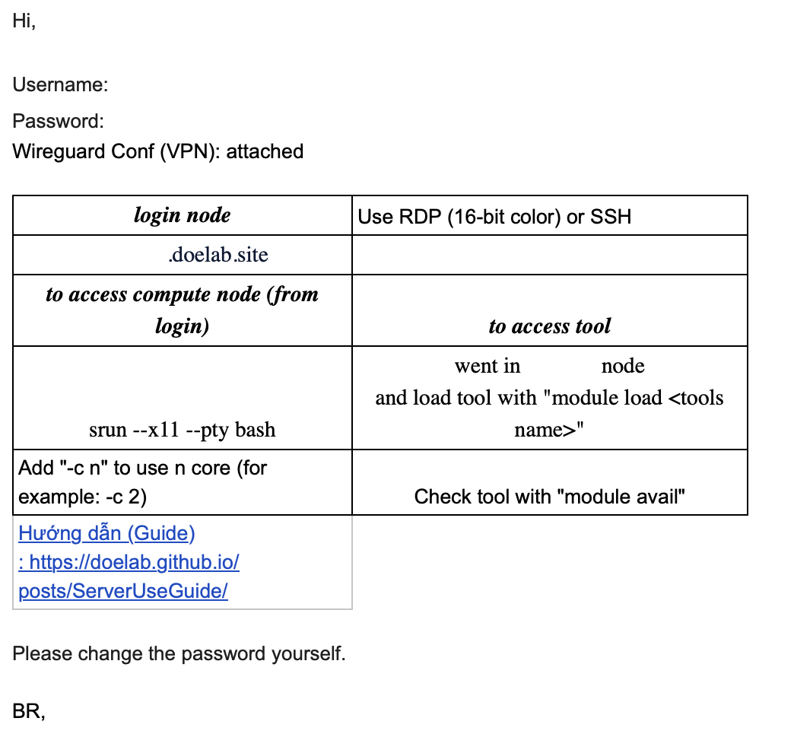
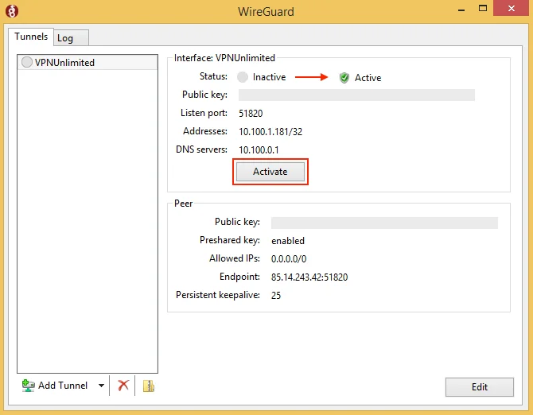
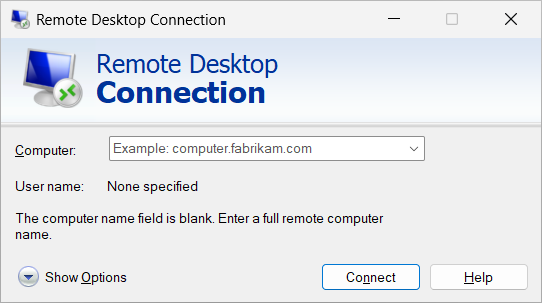
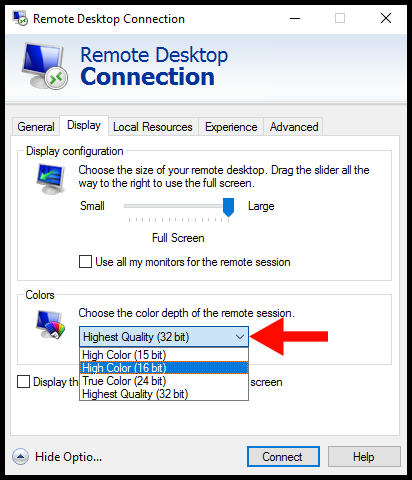
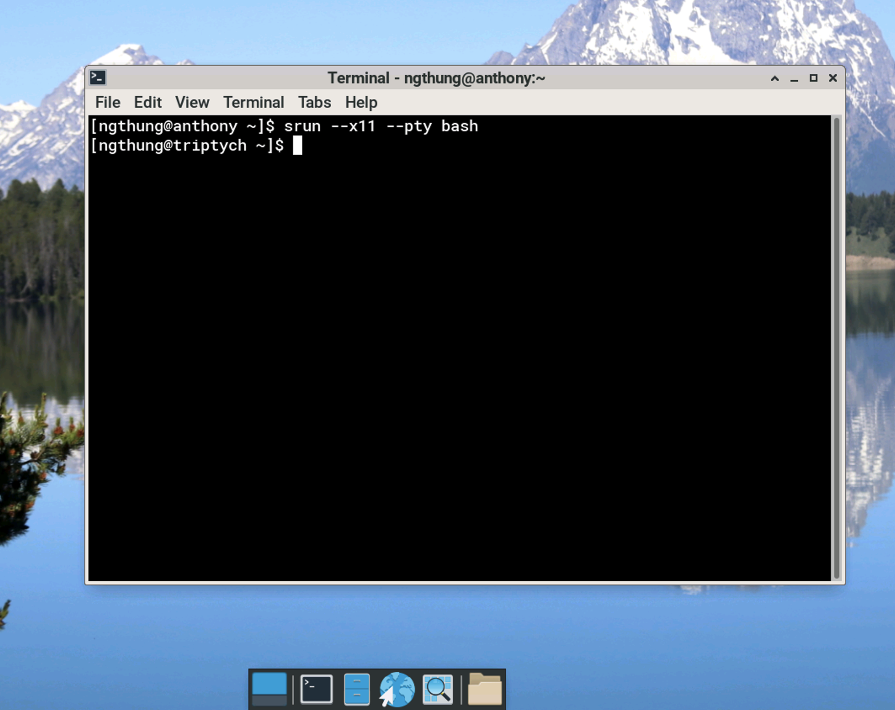
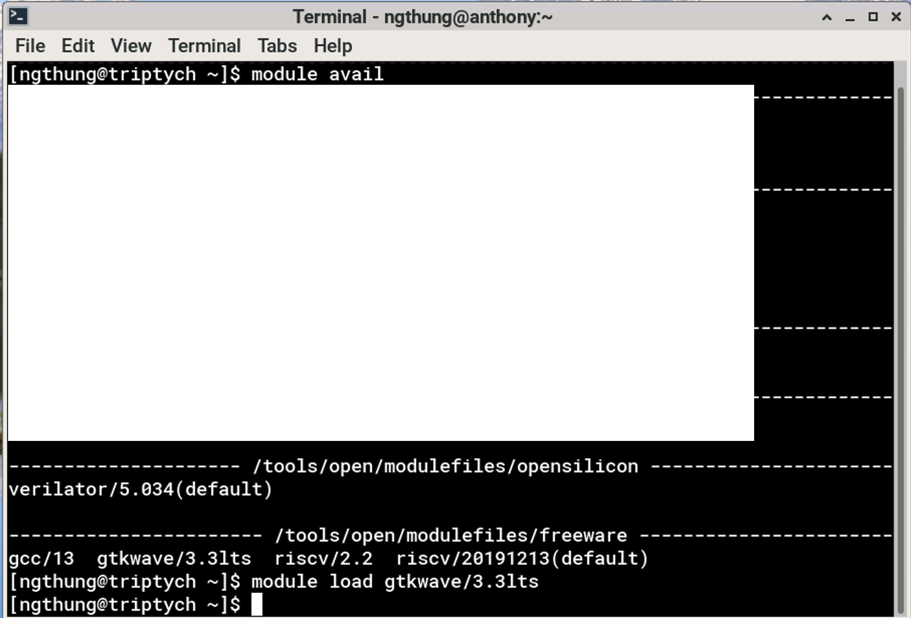
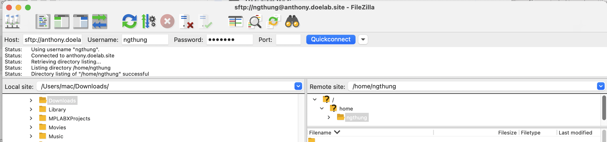
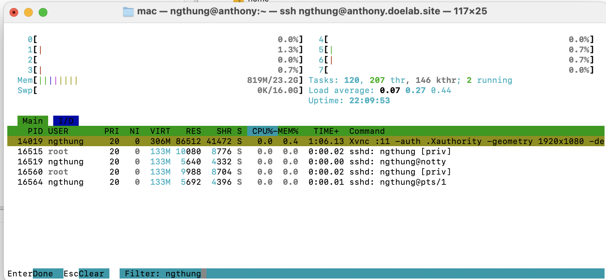

# Simple Server Guide

This guide provides step-by-step instructions for accessing and using the DOE lab server infrastructure.

## Step 1: Get Server Access

Receive your server access email containing:
- Username and password
- Wireguard configuration file
- Server domain name (e.g., `anthony.doelab.site`)



## Step 2: Install and Configure Wireguard

1. Install Wireguard on your system:
   - **Windows**: Download from [wireguard.com](https://www.wireguard.com/install/)
   - **MacOS**: `brew install wireguard-tools`
   - **Linux**: Use your distribution's package manager



2. Add the provided configuration file to Wireguard

3. Activate the VPN connection

> **Note**: Wireguard VPN does not work with HCMUT1/HCMUT2 WiFi networks.

## Step 3: Connect via Remote Desktop

1. Open your Remote Desktop client



2. **Important**: Set color depth to 16-bit



1. Enter the server domain name (e.g., `anthony.doelab.site`)
2. Use your provided username and password

### Step 3.1: Access Compute Node

In the server terminal, run:
```bash
srun --x11 --pty bash
```

You can see the shell prompt is changed to the compute node name.



This connects you to an available compute node with 1 CPU. Use `-c x` to request x CPUs if needed:
```bash
srun --x11 --pty -c 2 bash  # Request 2 CPUs
```

### Step 3.2: Manage Software Modules

On the compute node, use these commands:
```bash
module avail          # List available software/tools
module load <tool>    # Load a specific tool
module unload <tool>  # Unload a specific tool
```



## Step 4: Setup SSH Remote Development

Configure your preferred IDE (VSCode, etc.) for SSH remote development:
- Enable SSH remote extension
- Connect to the server using SSH
- Code and use terminal directly from your IDE

See detail in [this article](https://code.visualstudio.com/docs/remote/ssh).

## Step 5: File Transfer with FileZilla

1. Open FileZilla
2. Connect to: `sftp://{server_name}` (e.g., `sftp://anthony.doelab.site`)
3. Enter username and password
4. Leave port field empty
5. Transfer files between your computer and server



## Step 6: Troubleshoot RDP Issues

If your RDP session hangs (black screen or crash):

1. Connect via SSH to the server
2. Run `htop` to view running processes
3. Find and kill your own xrdp session



For more information regarding how to use htop, you can refer to [this article](https://dev.to/karandaid/mastering-the-linux-htop-command-4509).

## Step 7: Contact Administrator

If you encounter issues that cannot be resolved through the above steps, contact the administrator at: **ngthung@hcmut.edu.vn**

---

## Quick Reference Commands

| Command | Description |
|---------|-------------|
| `srun --x11 --pty bash` | Connect to compute node (1 CPU) |
| `srun --x11 --pty -c 2 bash` | Connect to compute node (2 CPUs) |
| `module avail` | List available software |
| `module load <tool>` | Load software module |
| `module unload <tool>` | Unload software module |
| `htop` | Monitor processes and kill sessions | 