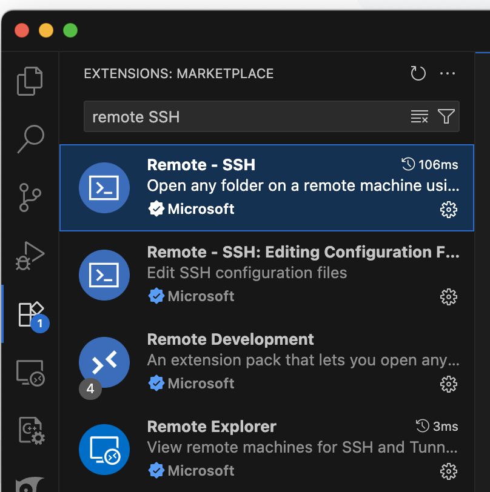
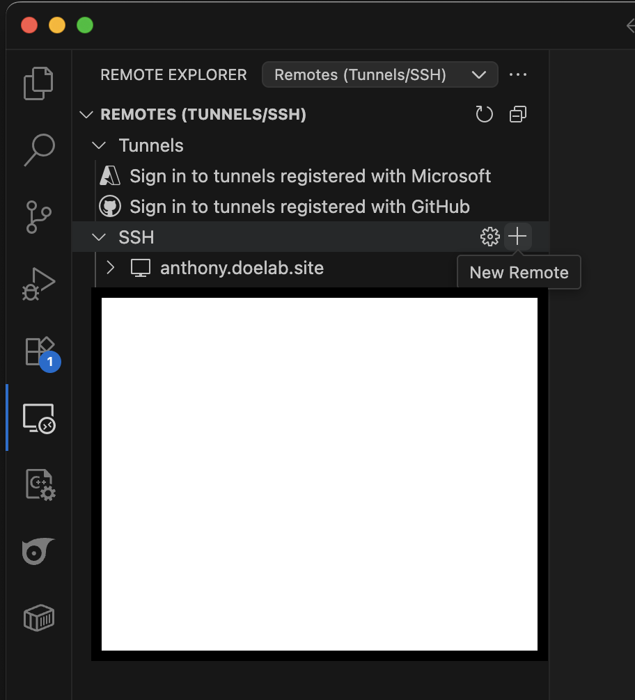
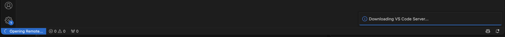
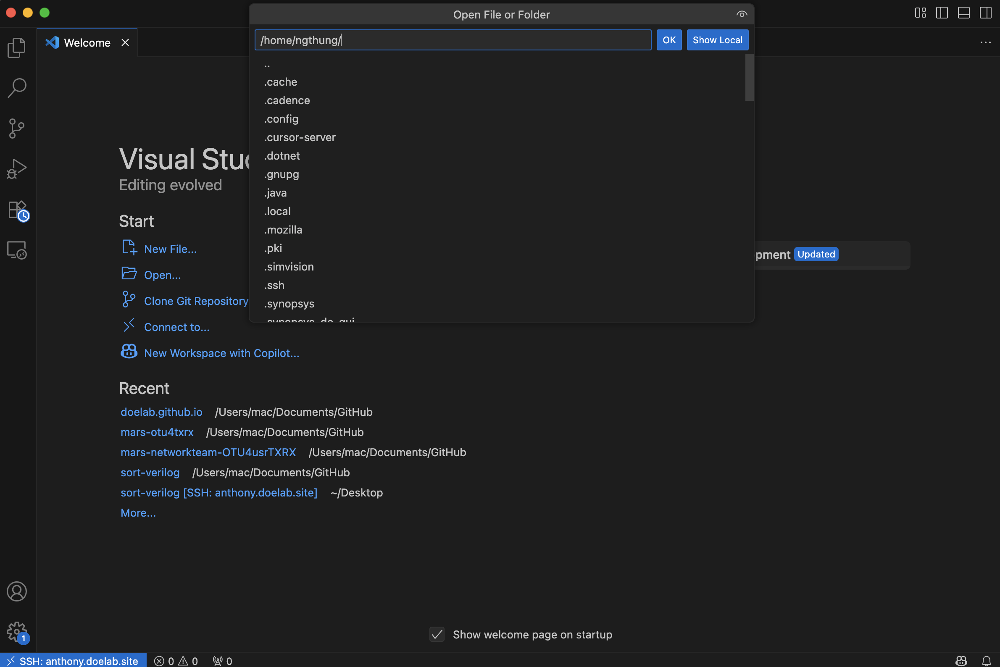
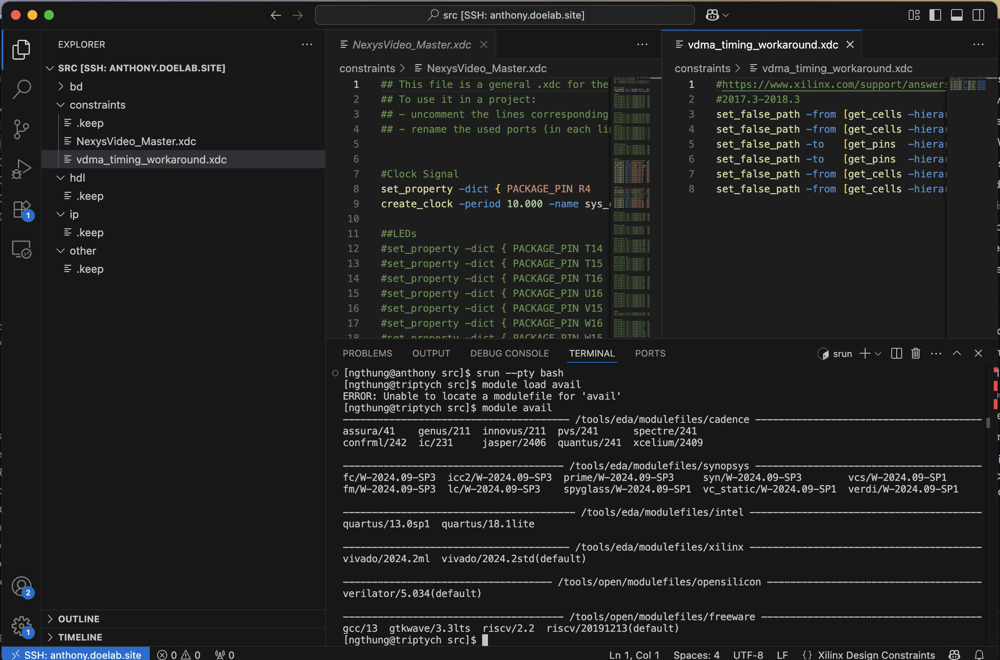
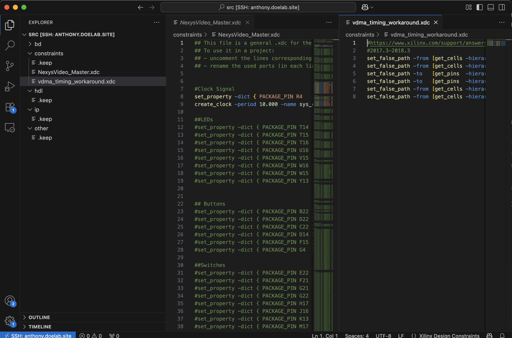

# VSCode Remote Server Connection Guide

This guide will walk you through setting up VSCode to connect to the DOE lab server for remote development, allowing you to code directly on the server from your local machine.

## Prerequisites

Before starting, ensure you have:
- VSCode installed on your local machine
- Server access credentials (username, password, domain)
- Wireguard VPN configured and connected
- SSH access to the server

## Step 1: Install VSCode Extensions

1. Open VSCode on your local machine
2. Go to Extensions (Ctrl+Shift+X)
3. Search for and install:
   - **Remote - SSH** (by Microsoft)
   - **Remote - SSH: Editing Configuration Files** (by Microsoft)



## Step 2: Configure SSH Connection

1. Open VSCode Command Palette (Ctrl+Shift+P) or click on the SSH icon in the left sidebar



2. Type "Remote-SSH: Connect to Host"
3. Select "Add New SSH Host"
4. Enter the SSH connection string:
   ```
   ssh username@server-domain
   ```
   Example: `ssh comp@anthony.doelab.site`


1. Choose the SSH configuration file location (usually the default)
2. VSCode will add the connection to your SSH config
3. Enter your password when prompted and wait for VSCode to download on the server.



## Step 3: Connect to Server

1. Open Command Palette (Ctrl+Shift+P)
2. Type "Remote-SSH: Connect to Host"
3. Select your configured server from the list
4. Choose the platform (Linux)
5. Enter your password when prompted
6. You will be connected to the server and can start developing and run code with the terminal from VSCode similar to SSH.

## Step 4: Access Compute Node

Once connected to the server, you'll be in the login node. To access a compute node:

1. Open a terminal in VSCode (Ctrl+`)
2. Run the srun command:
   ```bash
   srun --pty bash
   ```
3. Your terminal will now show the compute node name

## Step 5: Load Required Modules

On the compute node, load the software modules you need:

```bash
module avail          # List available modules
module load quartus   # Load Quartus (example)
module load questasim # Load QuestaSim (example)
```

## Step 6: Open Project Folder

1. In VSCode, go to File → Open Folder
2. Navigate to your project directory
3. Select the folder to open it in VSCode



## Step 7: Development Workflow

### File Operations
- Create, edit, and save files directly on the server
- Use VSCode's file explorer to manage your project structure
- All changes are saved directly on the server

### Terminal Usage
- Use the integrated terminal for running commands
- Execute synthesis, simulation, and other tools
- Monitor processes and system resources



### Debugging
- Set breakpoints in your code
- Use VSCode's debugging features
- Monitor variables and program flow

## Step 8: Working with Multiple Files

VSCode provides excellent support for working with multiple files:

1. **Split Editor**: Right-click a tab → "Split Editor"
2. **Side-by-side**: Drag tabs to create side-by-side views
3. **File Explorer**: Use the file explorer to navigate your project



## Step 9: Extensions and Settings

### Install Extensions on Remote
1. Go to Extensions (Ctrl+Shift+X)
2. Install extensions that will run on the remote server:
   - **SystemVerilog** for HDL support
   - **Verilog-HDL** for Verilog support
   - **GitLens** for Git integration
   - **Python** for Python development

### Sync Settings
- VSCode will sync your settings between local and remote
- Customize your development environment as needed

## Step 10: File Transfer

### Upload Files
1. Use VSCode's file explorer to create new files
2. Copy and paste content from your local machine
3. Save files directly on the server

### Download Files
1. Open files in VSCode
2. Copy content to your local machine
3. Or use FileZilla for bulk transfers

## Troubleshooting

### Connection Issues
- Ensure Wireguard VPN is connected
- Verify server domain and credentials
- Check SSH configuration

### Performance Issues
- Close unnecessary files and tabs
- Use the integrated terminal efficiently
- Monitor server resources with `htop`

### Extension Problems
- Some extensions may not work on remote servers
- Install extensions that support remote development
- Check extension compatibility

## Best Practices

1. **Regular Saves**: Save your work frequently
2. **Backup**: Keep local copies of important files
3. **Resource Management**: Monitor CPU and memory usage
4. **Clean Sessions**: Log out properly when done
5. **Version Control**: Use Git for project management

## Quick Commands Reference

| Command | Description |
|---------|-------------|
| `Ctrl+Shift+P` | Open Command Palette |
| `Ctrl+`` | Open/Close Terminal |
| `Ctrl+Shift+X` | Open Extensions |
| `Ctrl+Shift+F` | Search in Files |
| `Ctrl+Shift+G` | Open Source Control |

## Advanced Features

### Remote Development
- Edit files directly on the server
- Run terminal commands remotely
- Debug applications on the server
- Use server resources for compilation

### Integrated Terminal
- Multiple terminal sessions
- Split terminal views
- Custom terminal profiles
- Command history

### File Synchronization
- Real-time file updates
- Conflict resolution
- Version control integration
- Backup and restore

---

For more detailed information about VSCode Remote Development, visit the [official Microsoft documentation](https://code.visualstudio.com/docs/remote/ssh). 